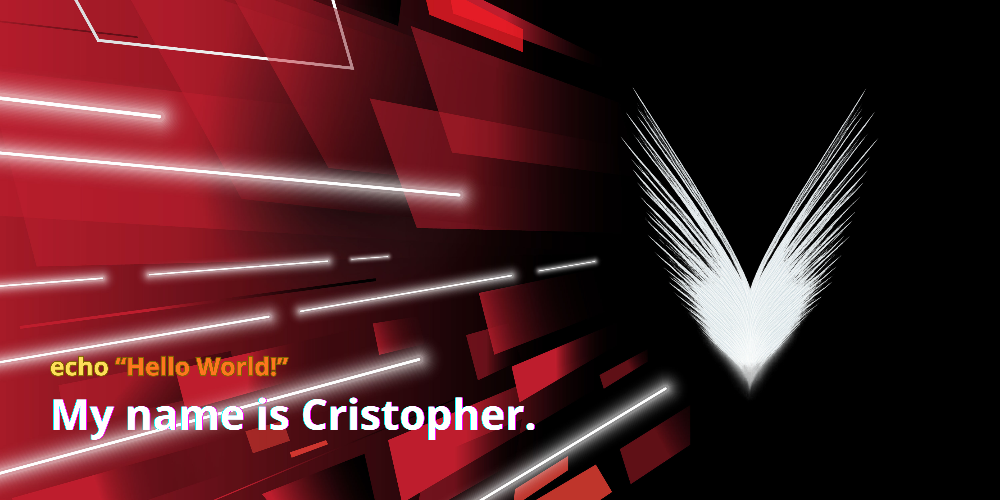

    

 
     

<pre>
👨🏻‍💻 Computer Systems Engineering student at Fidélitas University of Costa Rica.
🎓 Recently graduated with a Bachelor of Science in Computer Science and about to obtain his degree.
💻 Web application development and object-oriented programming (OOP) are my strengths.
💾 I have experience in other areas such as database management, project management and administration, network and communications design and control, and Machine Learning.
🤖 Passionate about technology, programming languages, and Machine Learning.
📚 Currently learning about Artificial Intelligence, Cybersecurity, and Data Analysis.
💡 Interested in expanding my knowledge every day and sharing proposals or ideas for future projects.
</pre>

## 🤝🏻 Connect with me

## 🛠️ Tech Stack

### 🖥️ Programming Languages

### 🧰 Frameworks & Libraries

### 🗄️ Database & Services

### ⚙️ Software & Tools

### 🚀 IDEs

### 💿 Distributions & Operating Softwares

## 📊 Profile Stats
<table align="center"> 
    <tr border="none">
        <td width="50%" align="center">
            
        </td>
        <td width="50%" align="center">
              
        </td>
    </tr>
</table>
<table align="center">
    <tr>
        <td width="50%" align="center">
               
        </td>
    </tr>
</table>

<picture>
    <source media="(prefers-color-scheme: dark)" srcset="images/breakout-dark.svg">
    <source media="(prefers-color-scheme: light)" srcset="images/breakout-light.svg">
    
</picture>

